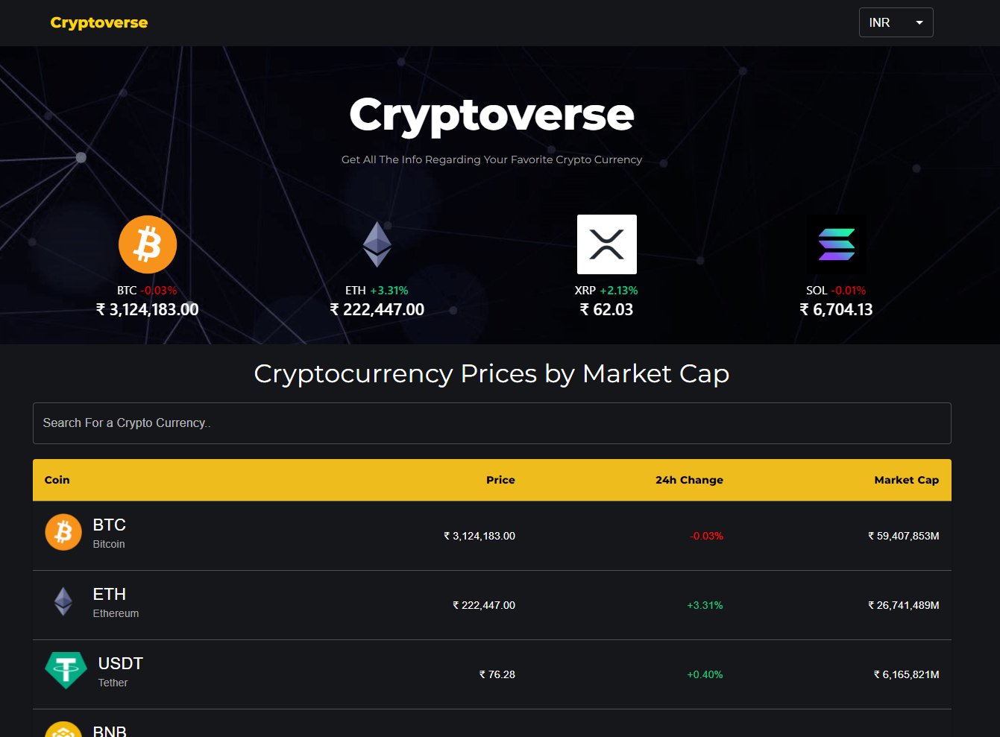
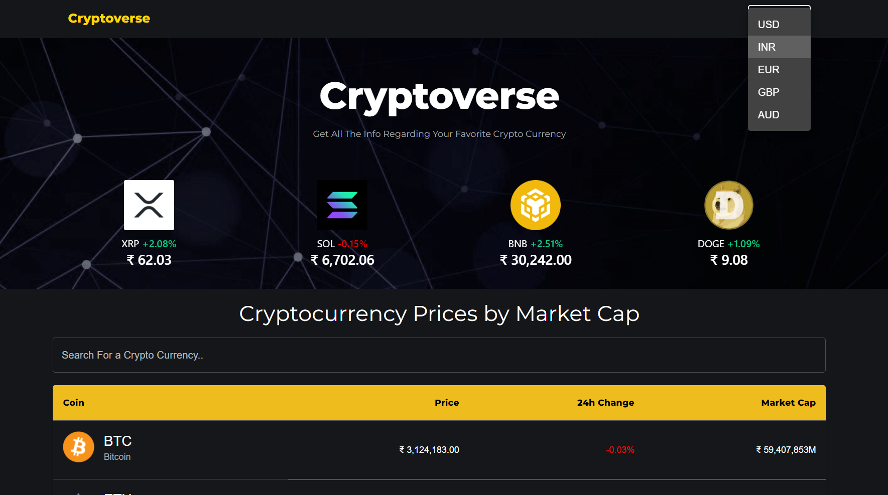
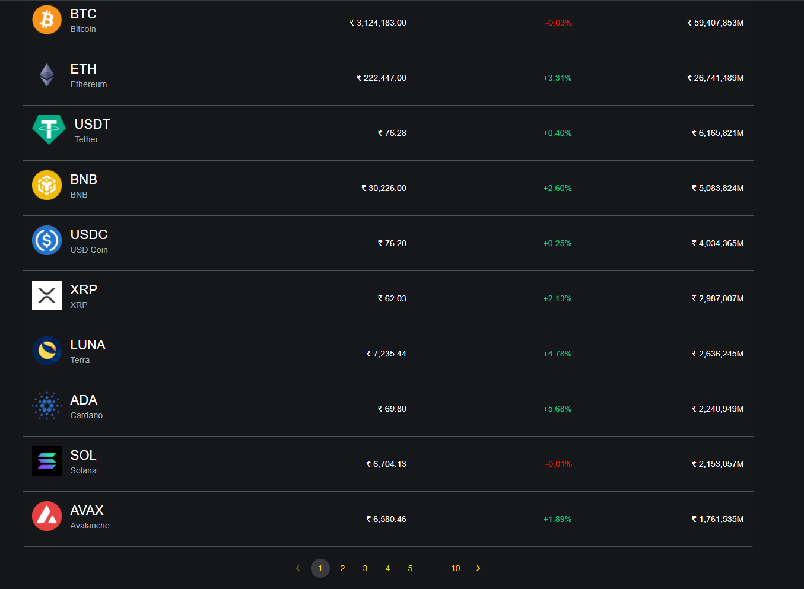
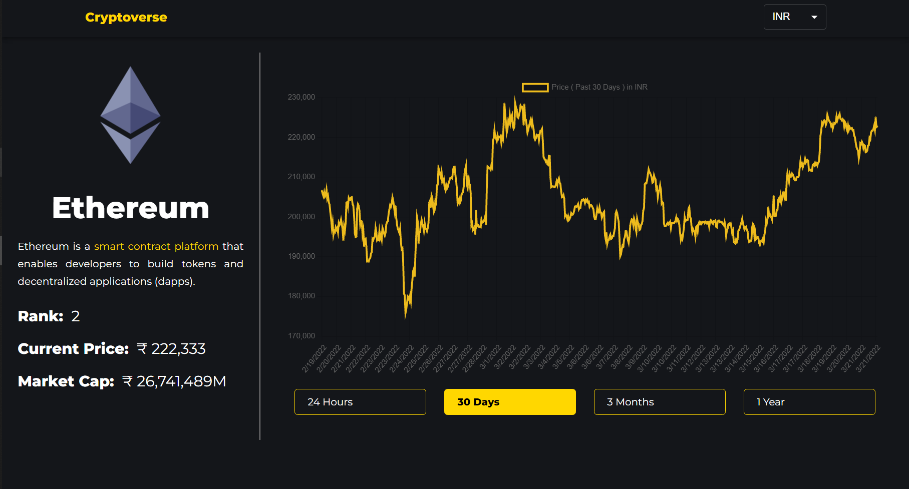

# CryptoVerse [Live Here](https://crypto-verse02.netlify.app/)
A **Cryptocurrency** Application built using **React.js & API used is CoinGecko** 
- A Fully responsive app with state management using **Context API**  &&  UI creation using  **Material UI** 
- Providing the real-time details of the top **100** cryptos in form of charts using **Chartjs** along with cryptostatistics . 
# HomePage

# CoinPage

